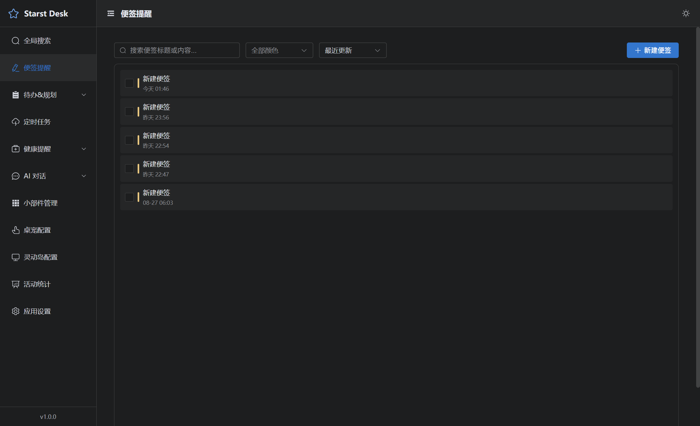
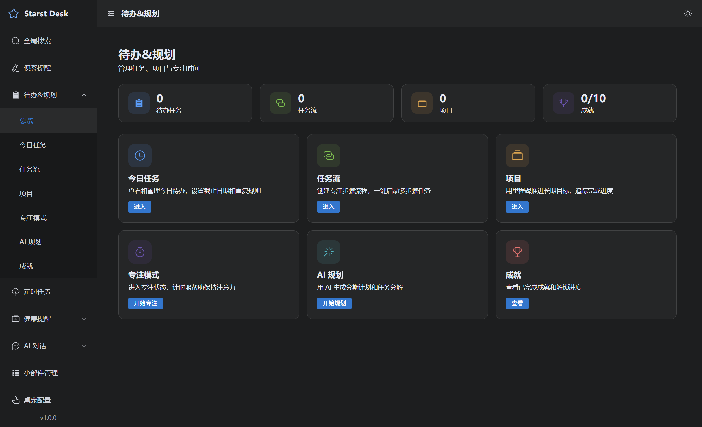
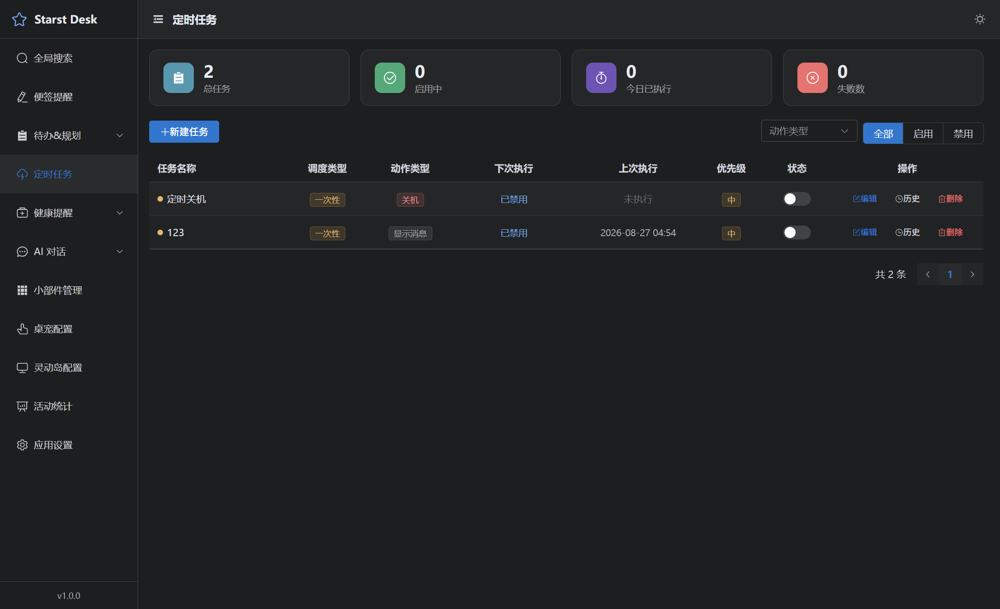
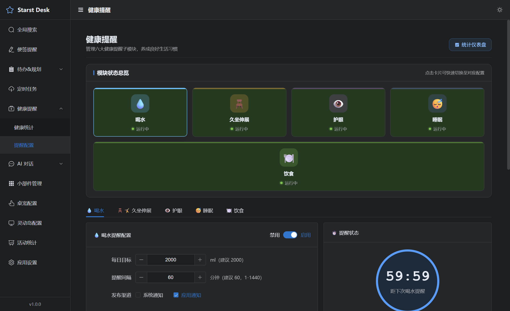
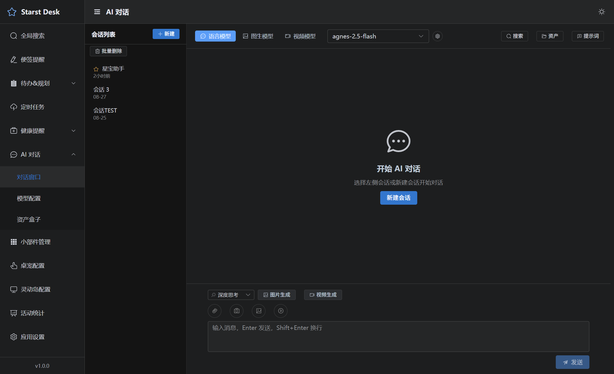
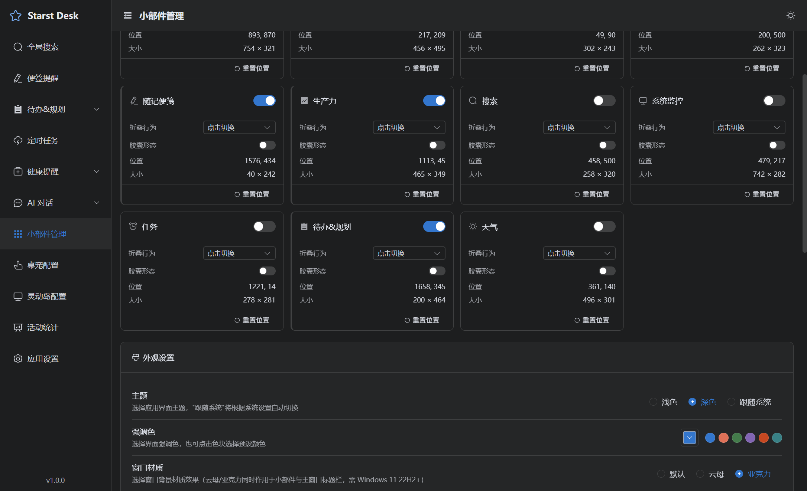

<div align="center">

# Starst Desk

**Windows 11 桌面助手** · 便签提醒 · 待办规划 · 定时任务 · 健康提醒 · AI 对话 · 桌面小部件 · 桌宠

[](LICENSE)
[](https://www.electronjs.org/)
[](https://vuejs.org/)
[](https://vitejs.dev/)
[](CONTRIBUTING.md)

</div>

## 项目简介

Starst Desk 是一款面向 Windows 11 的原生桌面助手应用，常驻系统托盘，集便签、待办、定时任务、健康提醒、AI 对话、桌面小部件、桌宠、灵动岛于一体，所有数据本地存储，注重隐私与离线可用。

## 功能特性

| 模块 | 能力 |
|------|------|
| **便签提醒** | 富文本便签（Quill）管理与定时提醒 |
| **待办与规划** | 今日任务、任务流、项目、专注模式与专注护盾、AI 规划、成就系统 |
| **定时任务** | 一次性 / 循环任务调度，支持命令执行与到点确认 |
| **健康提醒** | 喝水、久坐、护眼、伸展、睡眠、饮食六大提醒，含完成记录与统计 |
| **AI 对话** | 流式对话，支持 Ollama / DeepSeek / OpenAI / Anthropic / Gemini / 自定义模型，附件与资产盒子 |
| **桌面小部件** | 多种小部件、全局热键唤起、材质管理、胶囊模式、桌面整理 |
| **桌宠** | 桌面宠物常驻，键盘敲击反馈动画 |
| **灵动岛** | 通知与状态展示 |
| **活动统计** | 活动监测与键盘统计 |
| **全局搜索** | 跨模块快速搜索 |
| **应用设置** | 数据目录可配置、备份 / 恢复、缓存管理、开机自启、导入导出 |

> 所有数据存储于 `%APPDATA%\StarstDesk`，AI 模型配置仅保存在本地，不上传远端。

## 截图

> 截图随版本更新，存放于 `docs/screenshots/`。

| 便签提醒 | 待办与规划 |
|:---:|:---:|
|  |  |

| 定时任务 | 健康提醒 |
|:---:|:---:|
|  |  |

| AI 对话 | 小部件管理 |
|:---:|:---:|
|  |  |

## 技术栈

| 层次 | 技术 | 版本 |
|------|------|------|
| 桌面框架 | Electron | ^43.4.1 |
| 前端框架 | Vue 3 | ^3.5.41 |
| 构建工具 | Vite | ^8.2.2 |
| UI 组件库 | Element Plus | ^2.14.5 |
| 状态管理 | Pinia | ^4.0.3 |
| 路由 | Vue Router | ^5.2.0 |
| 本地数据库 | better-sqlite3 | ^13.0.3 |
| 富文本 | Quill | ^2.0.3 |
| Markdown | markdown-it + highlight.js | — |
| 打包工具 | electron-builder | ^26.15.0 |
| 包管理器 | pnpm | — |

## 快速开始

### 环境要求

- Windows 10 / 11（目标平台）
- Node.js >= 18
- pnpm >= 9

### 安装与运行

```bash
# 启用 pnpm（若未安装）
npm install -g pnpm

# 安装依赖（会自动执行 electron-rebuild 编译 better-sqlite3）
pnpm install

# 启动开发环境（Vite + Electron，支持 HMR 热更新）
pnpm dev
```

`pnpm dev` 会同时启动：
1. Vite 开发服务器（http://localhost:5173）
2. Electron 主进程（加载开发服务器地址）

### 打包发布

```bash
pnpm dist        # 构建并打包为 Windows 安装包
pnpm dist:win    # 仅打包 Windows x64
```

### 重新编译原生模块

若 `better-sqlite3` 出现兼容性问题：

```bash
pnpm rebuild
```

## 命令说明

| 命令 | 说明 |
|------|------|
| `pnpm dev` | 启动开发环境（Vite + Electron） |
| `pnpm dev:vite` | 仅启动 Vite 开发服务器 |
| `pnpm dev:electron` | 仅启动 Electron（需 Vite 已启动） |
| `pnpm build` | 构建渲染进程到 dist/ |
| `pnpm preview` | 预览构建产物 |
| `pnpm dist` | 构建并打包为安装包 |
| `pnpm dist:win` | 仅打包 Windows x64 |
| `pnpm rebuild` | 重新编译 better-sqlite3 |
| `pnpm test` | 运行全部单元测试 |
| `pnpm test:dao` / `test:core` / `test:adapters` / `test:utils` / `test:modules` | 分模块测试 |

## 项目结构

```
Starst_Desk/
├── package.json              # 项目依赖与脚本
├── vite.config.mjs           # Vite 配置（渲染进程多入口构建）
├── index.html                # 主窗口入口
├── widget.html               # 桌面小部件入口
├── pet.html                  # 桌宠入口
├── island.html               # 灵动岛入口
├── reminder.html             # 提醒弹窗入口
├── LICENSE
├── CONTRIBUTING.md
├── CHANGELOG.md
├── SECURITY.md
│
├── electron/                 # Electron 主进程（CommonJS）
│   ├── main.js               # 主进程入口
│   ├── preload.js            # 预加载脚本（contextBridge 白名单）
│   ├── core/                 # 核心服务（窗口/托盘/调度/通知等）
│   ├── dao/                  # 数据访问层（better-sqlite3）
│   ├── ipc/                  # IPC 通道处理器
│   ├── adapters/             # AI 模型适配器
│   ├── services/             # 业务服务
│   ├── modules/              # 业务模块
│   └── utils/                # 工具函数
│
├── src/                      # Vue 渲染进程（ES modules）
│   ├── main.js               # 主应用入口
│   ├── App.vue               # 根组件
│   ├── router/               # 路由
│   ├── stores/               # Pinia 状态管理
│   ├── views/                # 页面组件
│   ├── components/           # 通用组件
│   ├── composables/          # 组合式函数
│   ├── assets/               # 静态资源与样式
│   └── utils/                # 工具函数
│
├── migrations/               # 数据库迁移脚本（按序号递增）
├── resources/                # 应用级资源（图标等）
├── tests/                    # 单元测试（node:test）
└── .github/                  # Issue/PR 模板与 CI
```

## 架构说明

- **主进程**（`electron/`）：CommonJS 模块，可访问 Node.js API（better-sqlite3、fs、child_process 等）。
- **渲染进程**（`src/`）：ES modules，**禁止直接访问 Node API**，所有数据通过 IPC 获取。
- **预加载脚本**（`electron/preload.js`）：通过 `contextBridge` 暴露受控 API，仅白名单通道可通信，确保安全性。
- **IPC 通信**：通道命名规范 `module:action`，统一响应格式 `{ ok, data }` / `{ ok: false, error }`。
- **多窗口**：主窗口、桌面小部件、桌宠、灵动岛、提醒弹窗各自独立入口，由主进程统一管理。

## 数据库迁移

迁移脚本位于 `migrations/`，文件名格式 `0XX_描述.sql`，由 `electron/core/migration.js` 在应用启动时按序号自动执行。

> 已发布的迁移文件不可修改，如需变更请新增迁移。

## 测试

```bash
pnpm test              # 全量
pnpm test:dao          # 数据访问层
pnpm test:core         # 核心模块
pnpm test:adapters     # AI 适配器
pnpm test:utils        # 工具函数
pnpm test:modules      # 业务模块
```

## 贡献

欢迎参与共建！请先阅读 [贡献指南](CONTRIBUTING.md) 与 [行为准则](CODE_OF_CONDUCT.md)。

- 报告缺陷 / 功能建议：[提交 Issue](https://github.com/InspirationStar/Starst-Desk/issues)
- 提交代码：[发起 Pull Request](https://github.com/InspirationStar/Starst-Desk/pulls)
- 安全问题：参见 [SECURITY.md](SECURITY.md)

## 致谢

本项目在设计与实现上受到 DeskBox、FlowTodo 等优秀开源项目的启发。致敬这些让开发者生活更美好的开源项目，也感谢每一位 Star 与 Issue 背后的开发者——是你们让 Starst Desk 持续成长。

## 赞助

如果 Starst Desk 对你的工作或生活有帮助，欢迎请作者喝一杯咖啡 ☕

你的支持是项目持续维护与迭代的动力。


## License

[MIT](LICENSE) © InspirationStar
